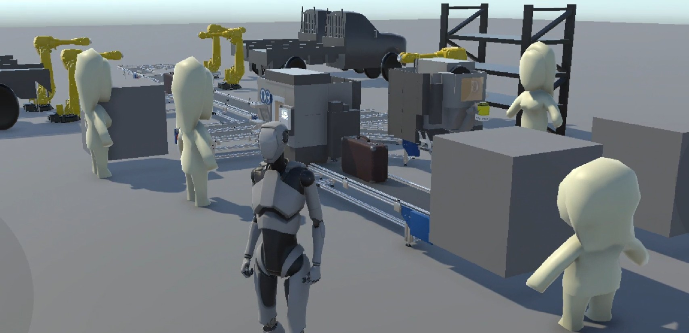
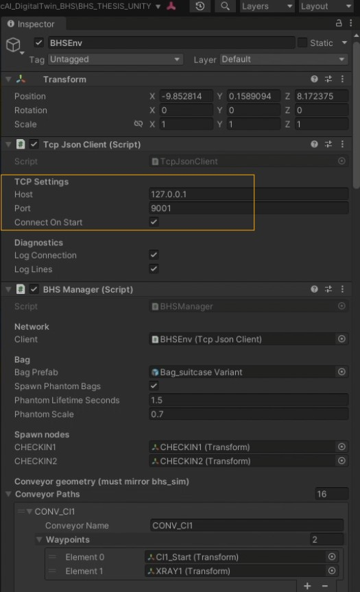

# Part 2 - Master's Thesis - Unity Digital Twin for Airport Baggage Handling System Cybersecurity

This repository contains **Part 2** of the master’s thesis project:
**Digital Twin and Machine-Learning-based ICS/OT Cybersecurity and Anomaly Detection in Airport Baggage Handling System**

Part 1 (Python/SimPy/ML) Repository of the Thesis can be found here : https://github.com/KSR2001/BSI_BHS_Thesis_Aviation

This repository contains the **Unity 3D digital twin visualization** for the simulated airport baggage handling system. It is designed to work together with the separate Python/SimPy/ML backend repository, which contains the simulation, feature engineering, machine learning models, evaluation scripts, and online proxy scripts.

The Unity project visualizes baggage movement, conveyor activity, sensors, diverters, manual coding, storage, build areas, cyber-physical attack effects, and model-based alerts.

---


## Demo Video

Click the image below to watch the digital twin demonstration.

[](https://drive.google.com/file/d/1iV6qbu4FeMz8gd3BeDgkF0C8kQvjsYWd/view?usp=sharing)


## 1. Repository Role

This Unity repository is the visualization/frontend part of the thesis prototype.

The Python backend repository is responsible for:

* SimPy-based BHS simulation,
* event and telemetry streaming,
* LSTM-AE anomaly detection,
* Temporal CNN attack classification,
* online proxy scripts,
* alert and prediction message generation.

This Unity repository is responsible for:

* 3D visualization of the BHS layout,
* spawning and moving bags,
* mapping SimPy component names to Unity objects,
* highlighting conveyors, sensors, diverters, storage, MCS, and build areas,
* visualizing cyber-physical anomalies,
* displaying prediction and alert messages received from the proxy.

---

## 2. Related Repository

The Python/SimPy/ML backend is maintained in a separate repository (Part 1):

```text
BSI_BHS_THESIS_AVIATION : https://github.com/KSR2001/BSI_BHS_Thesis_Aviation
```

Recommended local setup:

```text
BHS_Thesis_Workspace/
├── BSI_BHS_THESIS_AVIATION/
└── BHS_THESIS_Unity/
```

The two repositories do not need to be merged. They communicate through local TCP ports.

---

## 3. Unity Project Structure

```text
BHS_THESIS_Unity/
├── Assets/              # Unity scenes, scripts, prefabs, materials, and visualization assets
├── Packages/            # Unity package manifest and package lock file
├── ProjectSettings/     # Unity project settings
├── README.md
├── .gitignore
└── LICENSE
```

---

## 4. Main Unity Scripts

The Unity digital twin is implemented using a small set of C# scripts that receive streamed JSON messages, update the BHS scene, move bag objects, highlight components, and visualize anomaly alerts.

| Script | Purpose |
|---|---|
| `TcpJsonClient.cs` | TCP client that connects to the Python proxy or SimPy stream, reads newline-delimited JSON messages, and stores incoming messages in a thread-safe queue for Unity processing. |
| `MessageModels.cs` | Defines the C# message models used to parse incoming JSON messages, including base messages, process event messages, and alert messages. |
| `BHSManager.cs` | Main Unity controller for the BHS digital twin. It reads incoming messages, spawns bags, updates bag positions, maps SimPy component names to Unity objects, triggers highlights, handles alerts, and coordinates human/robot animations. |
| `BagAgent.cs` | Controls individual bag movement and bag visualization. It moves bags toward streamed conveyor positions and changes bag colour according to attack-related flags such as spoofing, false data injection, or phantom sensor events. |
| `Highlighter.cs` | Provides visual highlighting for BHS components. It flashes components differently for normal activity and anomaly-related activity. |
| `BHSPersonHandler.cs` | Triggers simple human animations at process stages such as check-in and manual coding. These animations support visualization only and do not affect simulation logic. |
| `BHSRobotArm.cs` | Controls simple robot-arm pick-and-place animations for storage and build-area handling. These animations improve process understanding but do not change the simulated BHS state. |

These scripts are designed around the principle that **SimPy remains the source of truth** for the process logic. Unity does not independently decide routing, queueing, attack effects, or anomaly states. Instead, Unity visualizes the events, progress updates, predictions, and alerts received from the Python simulation and proxy layer.

---

## 5. Requirements

* Unity Editor
* Unity Hub
* Newtonsoft.Json package for parsing incoming JSON messages in Unity
* Python backend repository running the SimPy simulator and selected online proxy
* Localhost TCP communication enabled

---

## 6. Important Asset Notice

This Unity project may depend on third-party Unity assets used for building the 3D digital twin scene.

Before redistributing this repository publicly, check the license of all third-party assets. Paid or proprietary Unity Asset Store packages should not be redistributed publicly unless their license explicitly allows it.

When required, remove third-party asset files from the public repository and document them as external dependencies.

---

## 7. Runtime Architecture

The online digital twin loop uses three components:

1. **SimPy simulator**

   * Generates BHS process events and telemetry.
   * Streams newline-delimited JSON messages to the proxy.

2. **Online proxy**

   * Receives the SimPy stream.
   * Reconstructs rolling 60-second feature windows.
   * Applies either the LSTM-AE or Temporal CNN model.
   * Sends process events, predictions, and alerts to Unity.

3. **Unity digital twin**

   * Receives JSON messages from the proxy.
   * Animates bags and BHS components.
   * Visualizes cyber-physical anomalies and alerts.

---

## 8. Port Configuration

Unity should connect to the proxy output port, not directly to the SimPy stream.

| Mode | Unity Host | Unity Port | Purpose |
|---|---|---:|---|
| LSTM-AE anomaly detection | `127.0.0.1` | `9001` | Receives anomaly alerts based on reconstruction error |
| Temporal CNN attack classification | `127.0.0.1` | `9002` | Receives class predictions and attack alerts |

The SimPy simulator streams upstream messages to:

| Component | Host | Port |
|---|---|---:|
| SimPy stream | `127.0.0.1` | `8765` |

<p align="center">
  
</p>

---


## 9. How to Run the Unity Digital Twin

### Step 1: Start the SimPy simulator

Open Terminal 1 in the Python backend repository inside the `Simpy_models` folder.

Example attack simulation:

```cmd
python bhs_sim_behavioral.py --mode attack --attacks fdi --fdi-flip-prob 0.7 --attack-start 200 --attack-duration 100 --arrival-rate 0.2 --runtime 600 --telemetry-dt 1.0 --realtime 1.0 --stream 127.0.0.1:8765 --stream-progress
```

### Step 2: Start one online proxy

Open Terminal 2 in the Python backend repository inside the `Simpy_models` folder.

For LSTM-AE anomaly detection:

```cmd
python 05_online_lstm_ae_proxy.py ^
  --modeldir models_lstm ^
  --upstream-host 127.0.0.1 --upstream-port 8765 ^
  --listen-host 127.0.0.1 --listen-port 9001 ^
  --telemetry-dt 1.0 --window 60 ^
  --warmup-sec 120 ^
  --calib-sec 0 ^
  --online-thr-mult 1.05 ^
  --require-consecutive 3 ^
  --cooldown-sec 3 ^
  --log1p-counts ^
  --reset-on-new-run
```

For Temporal CNN attack classification:

```cmd
python 05_online_temporal_cnn_proxy.py ^
  --modeldir models_tcnn_named ^
  --upstream-host 127.0.0.1 --upstream-port 8765 ^
  --listen-host 127.0.0.1 --listen-port 9002 ^
  --telemetry-dt 1.0 --window 60 --stride 5 ^
  --warmup-sec 120 ^
  --thr-conf 0.75 ^
  --require-consecutive 3 ^
  --cooldown-sec 2 ^
  --log1p-counts ^
  --reset-on-new-run ^
  --heuristic-stopped --verbose --send-predictions ^
  --stop-lookback 15 --stop-zero-frac 0.8 --stop-queue-min 1.0 --stop-exits-max 0.2
```

### Step 3: Open Unity

Open this Unity project in Unity Hub.

### Step 4: Set the Unity connection port

Use:

```text
9001 for LSTM-AE anomaly detection
9002 for Temporal CNN attack classification
```

### Step 5: Press Play

Click **Play** in Unity to start the digital twin visualization.

---

## 10. What Unity Visualizes

Unity visualizes the simulated BHS process using messages received from the proxy.

The visualization includes:

* bag spawning at check-in,
* bag movement along conveyor paths,
* conveyor progress updates,
* sensor triggers,
* diverter decisions,
* manual coding station activity,
* early baggage storage,
* build-area delivery,
* component highlighting,
* attack-related color changes,
* phantom sensor events,
* model predictions,
* anomaly alerts.

---

## 11. Message Types

Unity receives newline-delimited JSON messages from the proxy.

Typical message categories include:

* process events,
* telemetry updates,
* conveyor progress messages,
* prediction messages,
* alert messages.

The process events are used for animation and component highlighting. Prediction and alert messages are used to display model outputs and cyber-physical anomaly information.

---

## 12. LSTM-AE Visualization Mode

In LSTM-AE mode, Unity receives anomaly alerts based on reconstruction error.

The LSTM-AE can provide:

* anomaly score,
* anomaly decision,
* timestamp,
* suspected or affected component,
* short alert description.

This mode is useful for visualizing binary anomaly detection and component-level evidence based on reconstruction error.

Use Unity port:

```text
9001
```

---

## 13. Temporal CNN Visualization Mode

In Temporal CNN mode, Unity receives class predictions and alerts.

The Temporal CNN can provide:

* predicted class,
* confidence value,
* timestamp,
* alert type.

Possible classes are:

```text
normal
dos
spoof
fdi
stopped_conv
```

This mode is useful for visualizing known attack-type classification in the digital twin.

Use Unity port:

```text
9002
```

---

## 14. Troubleshooting

### Unity does not receive messages

Check the following:

1. The SimPy simulator is running.
2. SimPy is streaming to `127.0.0.1:8765`.
3. The selected proxy is running.
4. Unity is connected to the proxy port, not the SimPy port.
5. Use `9001` for LSTM-AE and `9002` for Temporal CNN.
6. No other program is already using the selected port.
7. Restart in this order: SimPy first, proxy second, Unity third.

### Bags do not move

Check:

1. SimPy was started with `--stream-progress`.
2. Unity component names match the SimPy component names.
3. Conveyor path mappings are assigned in the Unity inspector.
4. The TCP client in Unity is connected.

### Components do not highlight

Check:

1. The component name in the JSON message matches the Unity object mapping.
2. The highlighter script is assigned to the correct Unity object.
3. The event type is supported by the Unity message handler.

### Alerts do not appear

Check:

1. The proxy has passed the warmup period.
2. The selected model directory is correct.
3. The correct proxy is running.
4. The correct Unity port is selected.
5. Confidence threshold or consecutive-alert settings are not too strict.

---

## 15. Research Status

This repository is part of a master’s thesis research prototype. It demonstrates how a Unity-based digital twin can be connected to a SimPy-based BHS simulator and machine-learning inference proxies for cyber-physical anomaly visualization.

The system is intended for research and demonstration purposes only. It does not use real airport BHS data and is not validated for real airport operations.

---


## 16. License

This project is licensed under the Apache License 2.0. See the `LICENSE` file for details.

Third-party Unity assets may have their own licenses. Those licenses must be respected separately.

---

## 17. Author

Kuldeep Singh  
M.Sc. Geoinformatics and Spatial Data Science  
University of Muenster, Germany
